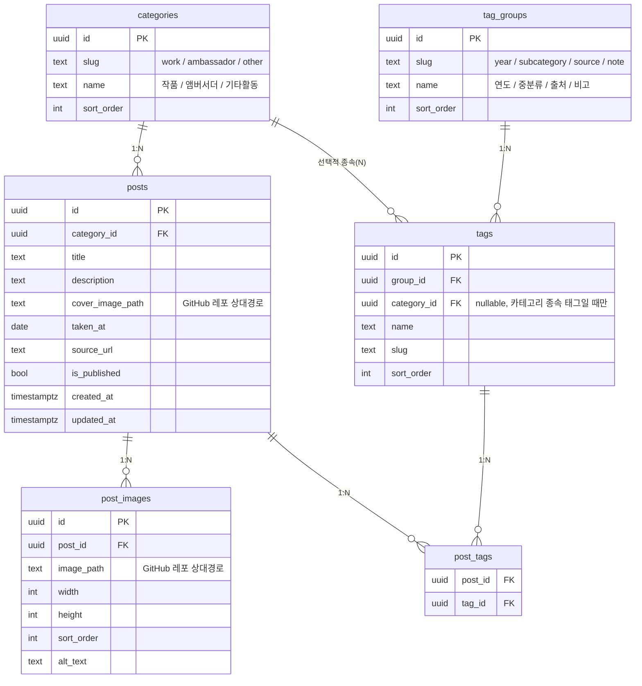

# DB 스키마 설계 — 배우 사진 아카이브

Next.js + Supabase(Postgres) 기준. 마이그레이션 파일: `supabase/migrations/`

## 설계 원칙

- **카테고리(최상위)**: 작품 / 앰버서더 / 기타활동 — 게시물마다 **1개만** 선택되는 값이라 `posts.category_id` FK로 표현 (다대다 아님).
- **연도 / 중분류 / 출처 / 비고**: 게시물당 여러 개가 붙을 수 있고 필터링 대상이라 `Post — Post_Tag — Tag` 다대다 구조로 표현. `tag_groups` 테이블로 4개 그룹(연도/중분류/출처/비고)을 나누고, `tags.group_id`로 소속을 지정.
- **중분류처럼 카테고리에 종속되는 태그**(예: 앰버서더의 브랜드명 vs 작품의 드라마/영화/예능명)는 `tags.category_id`(nullable FK)로 표현. 연도·출처처럼 카테고리 무관 태그는 `category_id = null`.
- **이미지**는 GitHub 레포에 저장하는 초기 방침에 맞춰 DB에는 **상대경로만** 저장(`cover_image_path`, `post_images.image_path`). 절대 URL은 프론트에서 base URL과 조합 → 추후 Cloudinary 등으로 옮길 때 스키마 변경 없이 base URL 환경변수만 교체하면 됨.
- **RLS**: `anon`은 조회(select)만 가능, 비공개(`is_published = false`) 게시물은 숨김. 쓰기는 `service_role` 키를 쓰는 자동화 스크립트(엑셀 임포터)에서만 수행 — 로그인/회원가입 기능 자체가 필요 없음(무료 운영, 카드 등록 없음 요건과 부합).

## ERD



## 테이블별 요약

| 테이블 | 역할 |
|---|---|
| `categories` | 최상위 대분류(작품/앰버서더/기타활동). 시드 완료 |
| `tag_groups` | 필터 그룹(연도/중분류/출처/비고). 시드 완료 |
| `tags` | 실제 태그 값. `출처`는 미리 시드, 나머지는 엑셀 임포트 시 upsert |
| `posts` | 게시물(폴더 1개 = 행 1개) |
| `post_images` | 게시물 내 다중 이미지 |
| `post_tags` | Post↔Tag 다대다 조인 |

## 폴더 자동화와의 매핑 (구현 완료)

`archive_excel_generator.py`의 폴더 규칙(`루트/연도/대분류/중분류/출처/비고/파일`)을 그대로
재사용하는 `scripts/import_to_supabase.py`가 다음과 같이 매핑한다.

1. 같은 (연도, 대분류, 중분류, 출처, 비고) 폴더 조합 = 게시물(post) 1개. 폴더 경로를
   `posts.import_key`로 저장해 재실행 시 upsert 기준으로 사용.
2. 대분류 → `CATEGORY_FOLDER_MAP`(작품→work, 앰버서더→ambassador, 기타활동→other)으로
   `categories.slug` 조회 후 `posts.category_id`. 매핑에 없는 대분류 값은 건너뛰고 목록으로 알려줌.
3. 중분류(드라마명/브랜드명 등, "N/A"가 아닐 때만) → `tags` upsert(`group=subcategory`,
   `category_id=해당 카테고리`) 후 `post_tags` 연결
4. 연도 → `tags` upsert(`group=year`, `category_id=null`) 후 `post_tags` 연결
5. 출처("N/A"가 아닐 때만) → `tags`에서 이름으로 조회(이미 시드된 항목과 매칭) 후 없으면
   생성, `post_tags` 연결
6. 비고("N/A"가 아닐 때만) → `tags` upsert(`group=note`, `category_id=null`) 후 `post_tags` 연결
7. 폴더 내 이미지 파일들 → 지정한 대상 폴더(`--images-dest`)로 복사하면서 `post_images`에
   상대경로(`image_path`)로 upsert(재실행 시 중복 방지). 첫 번째 이미지를 `cover_image_path`로 지정

자세한 사용법은 [`scripts/README.md`](../scripts/README.md) 참고.

## Next.js 조회 예시

```ts
// 카테고리별 목록
const { data } = await supabase
  .from('posts')
  .select('*, post_images(*), post_tags(tags(*))')
  .eq('category_id', categoryId)
  .order('created_at', { ascending: false });

// 다중 태그 필터 (그룹 간 AND, 그룹 내 OR)
const { data } = await supabase.rpc('filter_posts', {
  p_category_slug: 'work',
  p_tag_ids: [yearTagId, sourceTagId],
});
```

## 참고 — 무료 운영 관련

- Supabase 무료 티어: 카드 등록 불필요. DB 500MB, 스토리지 1GB. 이 스키마는 메타데이터만 저장하고 이미지는 GitHub에 두므로 DB 용량은 사실상 문제 되지 않음. 단, **7일간 요청이 없으면 프로젝트가 일시정지**되니 완전 무인 운영 시 유의(재접속 시 자동 재개는 되지만 몇 초 지연 발생).
- 이미지는 `raw.githubusercontent.com`보다 `cdn.jsdelivr.net/gh/{user}/{repo}@{branch}/{path}` (jsDelivr, 무료 CDN)로 서빙하면 캐싱/속도가 낫습니다. DB에 상대경로만 저장해뒀기 때문에 base URL만 바꾸면 되고, 나중에 Cloudinary로 옮길 때도 동일합니다.
- 호스팅은 Next.js에서 API Route/ISR/이미지 최적화를 쓸 계획이면 **Vercel**을 권장합니다(무료, 카드 불필요). GitHub Pages는 완전 정적 export(`next export`)만 가능해서 서버 기능이 필요해지면 제약이 생깁니다.
