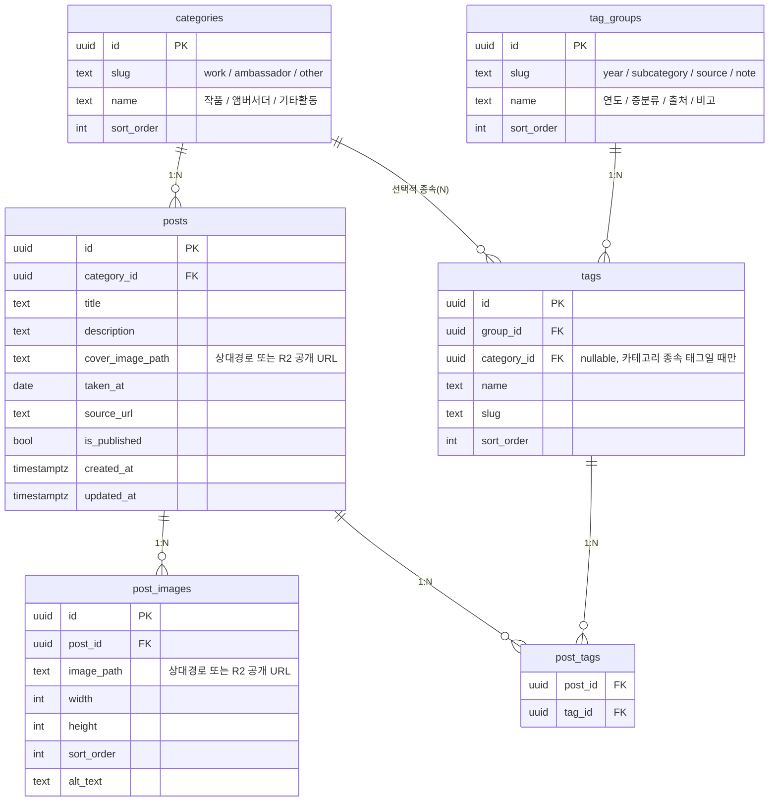

# DB 스키마 설계 — 배우 사진 아카이브

Next.js + Supabase(Postgres) 기준. 마이그레이션 파일: `supabase/migrations/`

## 설계 원칙

- **카테고리(최상위)**: 작품 / 앰버서더 / 기타활동 — 게시물마다 **1개만** 선택되는 값이라 `posts.category_id` FK로 표현 (다대다 아님).
- **연도 / 중분류 / 출처 / 비고**: 게시물당 여러 개가 붙을 수 있고 필터링 대상이라 `Post — Post_Tag — Tag` 다대다 구조로 표현. `tag_groups` 테이블로 4개 그룹(연도/중분류/출처/비고)을 나누고, `tags.group_id`로 소속을 지정.
- **중분류처럼 카테고리에 종속되는 태그**(예: 앰버서더의 브랜드명 vs 작품의 드라마/영화/예능명)는 `tags.category_id`(nullable FK)로 표현. 연도·출처처럼 카테고리 무관 태그는 `category_id = null`.
- **이미지**: `cover_image_path` / `post_images.image_path`에는 두 형태가 섞여 들어올 수 있다 — ① 이 레포 `public/images/` 기준 상대경로(초기에 GitHub에 직접 올렸던 이미지), ② Cloudflare R2 공개 URL 전체(대량 임포트 스크립트·관리자 페이지가 새로 올리는 이미지). 프론트(`src/lib/image.ts`)가 절대 URL이면 그대로, 아니면 상대경로로 처리해서 스키마/컬럼 변경 없이 저장소를 섞어 쓸 수 있게 했다.
- **RLS**: `anon`은 조회(select)만 가능, 비공개(`is_published = false`) 게시물은 숨김. 쓰기는 `service_role` 키를 쓰는 코드(대량 임포트 스크립트, 관리자 페이지의 서버 라우트)에서만 수행 — 일반 사용자 로그인/회원가입은 없고, 관리자 1명만 비밀번호로 `/admin`에 들어가는 구조.

## ERD



## 테이블별 요약

| 테이블 | 역할 |
|---|---|
| `categories` | 최상위 대분류(작품/앰버서더/기타활동). 시드 완료 |
| `tag_groups` | 필터 그룹(연도/중분류/출처/비고). 시드 완료 |
| `tags` | 실제 태그 값. `출처`는 미리 시드, 나머지는 엑셀 임포트 시 upsert |
| `posts` | 게시물(폴더 1개 = 행 1개) |
| `post_images` | 게시물 내 다중 이미지 |
| `post_tags` | Post↔Tag 다대다 조인 |

## 폴더 자동화와의 매핑 (구현 완료)

`archive_excel_generator.py`의 폴더 규칙(`루트/연도/대분류/중분류/출처/비고/파일`)을 그대로
재사용하는 `scripts/import_to_supabase.py`가 다음과 같이 매핑한다.

1. 같은 (연도, 대분류, 중분류, 출처, 비고) 폴더 조합 = 게시물(post) 1개. 폴더 경로를
   `posts.import_key`로 저장해 재실행 시 upsert 기준으로 사용.
2. 대분류 → `CATEGORY_FOLDER_MAP`(작품→work, 앰버서더→ambassador, 기타활동→other)으로
   `categories.slug` 조회 후 `posts.category_id`. 매핑에 없는 대분류 값은 건너뛰고 목록으로 알려줌.
3. 중분류(드라마명/브랜드명 등, "N/A"가 아닐 때만) → `tags` upsert(`group=subcategory`,
   `category_id=해당 카테고리`) 후 `post_tags` 연결
4. 연도 → `tags` upsert(`group=year`, `category_id=null`) 후 `post_tags` 연결
5. 출처("N/A"가 아닐 때만) → `tags`에서 이름으로 조회(이미 시드된 항목과 매칭) 후 없으면
   생성, `post_tags` 연결
6. 비고("N/A"가 아닐 때만) → `tags` upsert(`group=note`, `category_id=null`) 후 `post_tags` 연결
7. 사진 파일들 → 리사이즈(긴 변 2000px) 후 Cloudflare R2에 업로드, `post_images`에
   R2 공개 URL을 `image_path`로 upsert(재실행 시 이미 올라간 파일은 재업로드하지 않음).
   첫 번째 이미지를 `cover_image_path`로 지정

관리자 페이지(`/admin`)에서 몇 장씩 추가/수정할 때도 같은 테이블 구조를 그대로 쓴다 —
차이는 이미지가 브라우저에서 직접 R2로(presigned URL) 올라간다는 점뿐.

자세한 사용법은 [`scripts/README.md`](../scripts/README.md) 참고.

## Next.js 조회 예시

Supabase-js의 임베디드 셀렉트(`post_images(*)`처럼 관계를 중첩해서 조회하는 문법)는
`Database` 타입에 `Relationships`가 채워져 있어야 정확히 타입 추론이 되는데, 이 프로젝트는
타입을 손으로 작성해서 `Relationships: []`로 비워뒀다. 그래서 `src/lib/queries.ts`는
중첩 셀렉트 대신 테이블별로 나눠 조회한 뒤 애플리케이션 코드에서 조합한다.

```ts
// 카테고리별 목록 (post_images/post_tags 없이 카드 렌더링에 필요한 만큼만)
const { data } = await supabase.rpc('filter_posts', {
  p_category_slug: 'work',
  p_tag_ids: [],
});

// 상세 페이지: post + images + tags를 각각 조회해서 합침 (getPostDetail 참고)
```

## 참고 — 무료 운영 관련

- Supabase 무료 티어: 카드 등록 불필요. DB 500MB, 스토리지 1GB(사진은 여기 안 두므로 무관). 단,
  **7일간 요청이 없으면 프로젝트가 일시정지**되니 완전 무인 운영 시 유의(재접속 시 자동 재개는
  되지만 몇 초 지연 발생).
- 사진은 Cloudflare R2(무료 10GB, 다운로드 트래픽 완전 무료)에 저장한다. 5000장 이상처럼 규모가
  커지면 Supabase Storage(무료 1GB)나 GitHub 레포(용량이 커지면 클론/배포가 느려짐)보다 훨씬
  현실적이다. 임포트 스크립트가 업로드 전에 리사이즈(긴 변 2000px)까지 해주므로 원본 그대로
  올릴 때보다 용량이 훨씬 적게 든다.
- 호스팅은 Next.js에서 API Route/서버 컴포넌트를 쓰므로 **Vercel**을 권장합니다(무료, 카드
  불필요). GitHub Pages는 완전 정적 export만 가능해서 이 프로젝트 구조와는 맞지 않습니다.
